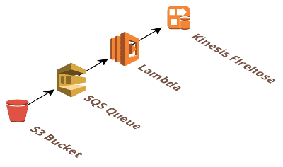

## AWS-firehose-s3-producer

### [View all Roadmaps](https://github.com/nholuongut/all-roadmaps) &nbsp;&middot;&nbsp; [Best Practices](https://github.com/nholuongut/all-roadmaps/blob/main/public/best-practices/) &nbsp;&middot;&nbsp; [Questions](https://www.linkedin.com/in/nholuong/)
 

AWS-firehose-s3-producer is an AWS Lambda function in Javascript that is designed to ingest
files uploaded to a S3 bucket into AWS Kinesis Firehose.

Files are uploaded to a S3 bucket which is configured to publish notifications to SQS.
SQS then triggers this lambda, which will read the file and stream it to Firehose.

## Features

 * *streams* files rather than load them to memory, therefore large files can be processed
 with minimal resources
 * gzipped files are supported

### Configuration

The Lambda requires the following environment variable to be set:
 * `FIREHOSE_STREAM_NAME`: the Kinesis firehose datastream to stream to.
 
Edit, then attach the [provided policy](policy.json) to the Role your AWS Lambda is configured to use.

# 🚀 I'm are always open to your feedback.  Please contact as bellow information:
### [Contact ]
* [Name: Nho Luong]
* [Skype](luongutnho_skype)
* [Github](https://github.com/nholuongut/)
* [Linkedin](https://www.linkedin.com/in/nholuong/)
* [Email Address](luongutnho@hotmail.com)
* [PayPal.me](https://www.paypal.com/paypalme/nholuongut)

# License